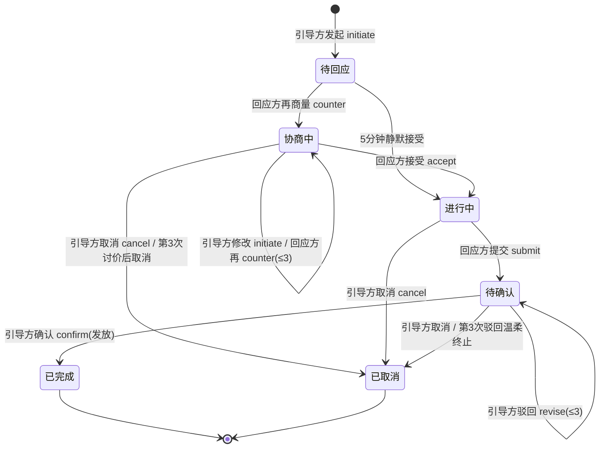
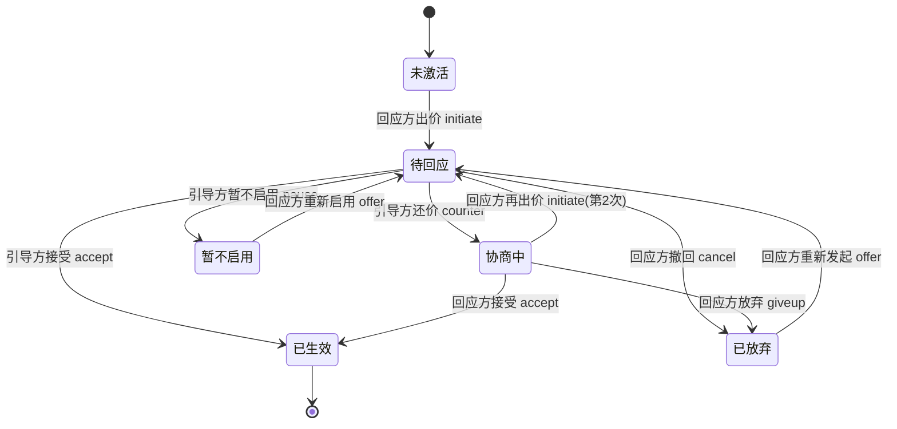

# 《听你的呀》交互说明文档（IDD）

> 版本：对应代码库 v3.0.0 ｜ 编写日期：2026-08-17
> 配套文档：`软件设计架构说明.md`（系统结构）、《架构蓝图.md》（产品设计原稿）
> 本文档回答三个问题：**每个页面上有什么？什么状态显示什么？每个按钮点了发生什么？** 以当前代码实际行为为准。

---

## 〇、通用交互约定（全站一致）

1. **页面跳转**：Tab 页（首页/印记/我们）用 `switchTab`；子页（配对/新建约定/详情/流水/卡册/日记/纪念日/拾光之旅）用 `navigateTo`；新建约定提交成功后用 `redirectTo` 覆盖当前页跳到详情。
2. **失败提示**：几乎所有云函数失败都 toast「没成功，别急，再试一次」；后端返回了 msg 时优先显示 msg（如「内容包含敏感词，请修改」「不能接受自己的邀请」「还差 X 分…」）。
3. **防连点**：提交类按钮都有锁（submitting / loading / redeeming / _joining / moodPublishing），重复点击不重复提交。
4. **输入限制**：约定标题 15 字、补充 30 字、理由/消息 50 字（后端强校验）、日记 100 字（**后端实际 50，超长会被拒，待修复**）、自定义心情 10 字、纪念日名 20 字、卡出价 3 位数字。
5. **字数规则**：约定相关事件 text 存 JSON（title/desc/way/reason），卡片报价存 JSON{reason}；其余事件 text 是纯文字。
6. **进入详情即已读**：详情页 load 完自动 markRead，首页通知消失。
7. **零红点页**：印记、日记、流水、纪念日、我的——除首页外无任何红点/未读提示。
8. **无推送**：所有提醒都是 App 内被动展示，不推送、不响铃、不震动。

---

## 一、配对页（创建 / 加入）

### 布局（自上而下）
1. 页面标题「开始你们的空间」；
2. join 模式（带分享参数进入）：信息确认卡；
3. 创建模式：身份 tab（引导方/回应方）+ 内容卡。

### 创建模式（引导方，默认）

| 元素 | 行为 |
|---|---|
| 身份 tab「引导方 / 回应方」 | 点切换；回应方侧显示等待卡「空间正在布置中」，无任何输入 |
| 空间名称（≤20） | 占位「例如：我和你的空间」 |
| 引导方称呼（≤20） | 占位「想好了再填」 |
| 回应方称呼（≤20） | 占位「想好了再填」 |
| 提示 | 「称呼一旦确认不再修改，想好了再填」 |
| 开始时间 radio | 「就从今天重新出发」/「我们早就在一起了」（选后者出现日期 picker，范围 2000-01-01~今天） |
| 主按钮「开启属于我们的空间」 | 任一字段为空 → toast「想好了再填」；否则弹确认 modal（展示空间名/双方称呼/开始时间 + 「分享给对方确认后才生效，确认前随时可以放弃」） |
| 确认 modal「生成邀请」 | 调 genInviteCode → 存 globalData.invite → switchTab 首页，首页显示「喊 TA 进来」邀请卡 |
| modal「再想想」 | 关闭，留在本页 |

### 加入模式（分享进入）

| 元素 | 行为 |
|---|---|
| 头部 | 「{引导方称呼} 把你们的空间建好了，就差你了」 |
| 信息行 | 空间名称 / 引导方称呼 / 你的称呼 / 我们开始的时间（只读） |
| 提示 | 「称呼由 {引导方} 为你设定，一旦确认不再修改」 |
| 主按钮「点确认，就正式在一起了」 | 调 joinSpace → 成功 switchTab 首页；失败 toast 后端 msg；**防连点锁** |
| 自己邀请自己 | 分享参数 g=自己的 openid → toast「不能接受自己的邀请」，不进入加入流程 |
| 已结对的人点开 | restore 发现已有空间 → 直接 switchTab 首页 |

### 异常态
- 邀请码已被占用（重复确认/他人已用）→ toast「邀请已经用过了」；
- 内容含敏感词 → toast「内容包含敏感词，请修改」；
- 生成邀请码 3 次撞码 → toast「没成功，别急，再试一次」。

---

## 二、首页（今日 Tab）

### 布局（自上而下）
1. 邀请卡（仅创建空间后未配对时出现）；
2. Hero 卡；
3. 纪念日提醒卡（仅引导方，今天有日子时）；
4. 节日提醒卡（七夕/情人节当天）；
5. 摘要行（小事/心意/随记/日子 四格）；
6. 「最近的小事」列表；
7. 通知卡「TA 在等你回话」（有未读才出现）。

### 逐块交互

**① 邀请卡（solo 状态）**
| 元素 | 行为 |
|---|---|
| 「喊 TA 进来」按钮（open-type=share） | 触发转发：标题「我把我们的空间建好了，就差你了。进来，把我们的故事记下来。」，路径带 code/g/n/gn/rn/sd 参数 |
| 「放弃邀请，重新开始」 | confirm modal「还没被接受，可以随时放弃。之后重新创建。」→ 放弃后回配对页 |

**② Hero 卡**
| 元素 | 行为 |
|---|---|
| 空间名标签 | 只读 |
| 「❀ 我们在一起的第 N 天」 | N=begin 事件 startDate 到今天+1；无 begin 不显示 |
| 日记引子 | 显示对方今天最后一条日记（最多 3 行）或「今天还没有日记」；点击 → 日记页 |
| 心情区（引导方视角） | 显示对方今日心情标签；无则「{称呼}还没有留下今天的状态」 |
| 心情选择器（回应方视角） | 点标签选中/再点取消；最多 3 个（超了 toast「最多选 3 个心情」）；「输入你的心情」展开输入（≤10 字+确认/取消）；**改动后 3 秒自动发布**（mood 事件），期间继续改则重置计时 |
| CTA（引导方） | 「新建约定」→ 新建约定页 |
| CTA（回应方） | 「我的心意卡」→ 卡册页 |

**③ 纪念日提醒卡（仅引导方）**
| 元素 | 行为 |
|---|---|
| 文案 | 「今天，值得好好记住」+「今天是你们的「{名称}」。一起走过的 {X} 天…」 |
| 「送 TA 52 分心意」 | appendEvent(anniversaryGrant) → 成功跳流水页；失败也收起提醒（幂等，不再弹） |
| 「今天先记着」 | appendEvent(remember) 静痕 → 收起提醒 |

**④ 节日提醒卡**
| 元素 | 行为 |
|---|---|
| 文案 | 七夕/情人节专用长文案（见架构说明） |
| 自动发放 | 页面加载时自动 appendEvent(festivalGrant)；重复打开不重复加（云函数幂等） |

**⑤ 摘要行**
- 小事 = 未终态约定数；心意 = 待回应/协商中的卡数；随记 = 今天日记数；日子 = 纪念日总数；为 0 时数字弱化（opacity 0.5）。

**⑥ 最近的小事**
- 列出所有未终态线程（约定标题/卡名 + 状态标签），点击 → 详情页；
- 空状态：「最近还没有在继续的小事。想一起做点什么吗？可以从一个小约定开始。」

**⑦ 通知卡「TA 在等你回话」**
- 从我的未读线程中选**一个**展示（优先"待回应"类：约定=对方 counter/submit/initiate、卡=我当前有可操作动作）；
- 点击 → markRead + 进详情页；
- 无未读时整卡隐藏。

---

## 三、新建约定页

| 元素 | 行为 |
|---|---|
| 约定标题（≤15） | 占位「例如：今天拍一张可爱自拍给我」 |
| 补充一句（≤30） | 占位「例如：今天想认真收到你的回应和记录」 |
| 完成方式 radio | 文字约定 / 拍照约定；**选拍照约定时提示**「完成时请用微信把照片发给 TA。拍照功能预计后续版本开放」（半成品） |
| 心意分（数字） | 0-50；越界 toast「心意分在 0-50 之间，重新填一下」；**清空不算 0**（提交时拦截「想好了再填」） |
| 「发出这个小约定」 | 任一必填缺失 → toast「想好了再填」；否则 appendEvent(initiate, JSON{title,desc,way}, score) → 成功 redirectTo 详情页 |

### 异常态
- 提交失败 → toast「没成功，别急，再试一次」；
- 内容含敏感词 → toast「内容包含敏感词，请修改」。

---

## 四、详情页（约定 / 心意卡 / 卡片约定 三合一）

路由识别：threadId 以 `card_` 开头=心意卡；含 `_execute_`=卡片约定；否则=普通约定。

### 通用结构
1. Hero（标题+状态标签+最新消息/说明+分值）；
2. 动作区（输入框 + 按钮组）；
3. 编辑区（修改约定/卡出价时展开）；
4. 软文案区（按状态出现）；
5. 事件流折叠卡「这个约定的经过」（默认收起，点标题展开/收起）。

### 4.1 普通约定

| 状态 | 引导方按钮 | 回应方按钮 | 输入框 | 软文案 |
|---|---|---|---|---|
| 待回应 | 取消这条约定 | 再商量一下 / 做好啦，提交 | 回应方可写 | — |
| 协商中（回应方刚讨价） | 修改约定 / 取消这条约定 | — | 无（引导方修改走编辑区） | — |
| 协商中（引导方刚修改） | — | 再商量一下 / 嗯，就这样 | 回应方可写 | — |
| 协商中（第 3 次讨价后） | 取消这条约定 | — | 无 | 给回应方：商量过的软文案 |
| 进行中 | 取消这条约定 | 做好啦，提交 | 回应方可写 | — |
| 待确认 | 就这样，很好 / 再试一次 / 取消这条约定 | — | 引导方点「再试一次」后出现理由输入 | — |
| 待确认（刚驳回） | 同上 | 做好啦，提交 | 回应方可写 | — |
| 温柔终止（revise≥3） | 就这样，很好 / 取消这条约定 | — | 隐藏 | 「你已经试了三次…」 |
| 已完成 / 已取消 | 无按钮 | 无按钮 | 无 | — |

**按钮细节**：
- 「再商量一下」（counter）：必须填理由，空则 toast「先写一下理由」；
- 「修改约定」：展开编辑区（标题/分值/修改理由选填），确认提交同 threadId 新 initiate；标题或分值空 → toast「想好了再填」；
- 「就这样，很好」（confirm）：不带文字，分值由云函数按最后谈定分入账；
- 「再试一次」（revise）：第一次点击先展开理由输入，填完再点提交；空理由 toast「先写一下理由」；
- 「做好啦，提交」（submit）：文字选填；
- 「取消这条约定」（cancel）：无输入。

**展示细节**：分数=最新带分 initiate/counter；标题/说明=第一条 initiate 的 JSON；对方最新消息优先取对方最近 counter 或修改 initiate 的理由。

### 4.2 心意卡

| 状态 | 引导方按钮 | 回应方按钮 |
|---|---|---|
| 待回应（第 1 次出价） | 按这个分来 / 再商量一下 / 暂不启用 | 这张卡先不发了 |
| 待回应（第 2 次出价后） | 按这个分来 / 暂不启用 | — |
| 协商中 | — | 再商量一下 / 按这个分来 / 这张卡先放着吧 |
| 暂不启用 | — | 重新启用 / 放弃这张卡 |
| 已放弃 | — | — |
| 已生效 | — | 使用心意卡（唯一按钮） |

**按钮细节**：
- 「再商量一下」（引导方 counter）：展开编辑区（新分值+理由选填）；
- 「再商量一下」（回应方 offer/重新出价）：同上，走 initiate；
- 「按这个分来」（accept）：直接用当前报价分值，无输入；
- 「暂不启用」（pause）：引导方软拒，无输入；
- 「这张卡先不发了」（withdraw→cancel）/「这张卡先放着吧」（giveup）：回应方终止；
- 「使用心意卡」（redeem）：调 redeemCard，**防连点锁**；成功 toast「已经用上了」+ redirectTo 新线程详情；余额不足 toast 后端 msg（「还差 X 分。先去完成几个约定，攒够了再兑换。」）。

**展示细节**：已生效显示「已锁定 {price} 分 · 以后可以随时唤起这个小心意」；报价事件显示「{X} 分 · {理由}」；accept 事件显示云函数自动文案；软文案两种（出价 2 次截止 / 暂不启用）。

### 4.3 卡片约定（兑换执行）

| 状态 | 引导方按钮 | 回应方按钮 | 说明 |
|---|---|---|---|
| 待执行 | 做好啦，提交 / 暂不执行 | — | initiate 后（待回应改写为待执行） |
| 待确认 | — | 就这样，很好 / 再试一次 / 取消这条约定 | confirm 不再加分 |
| 待确认（刚驳回） | 做好啦，提交 / 暂不执行 | — | 回应方驳回后引导方重做 |
| 温柔终止 | 就这样，很好 / 取消这条约定 | — | 引导方最终决定权 |
| 已完成 / 已取消 | — | — | pause/cancel 已退分 |

**规则**：「暂不执行」/「取消」→ 退回兑换分；「再试一次」必须填理由；输入框除温柔终止外始终显示（文字选填）；事件文案走专用翻译（"答应了，正在为你做这件事"等）。

---

## 五、印记页（时间线）

| 元素 | 行为 |
|---|---|
| 筛选 tab | 全部 / 约定 / 心意卡 / 随手记 / 心情；点击即重新拉取筛选 |
| 时间线 | 全量（limit 1000）按时间倒序；每条=图标+动作名+「类别 · 名」+内容+时间·称呼 |
| 点击条目 | **无跳转**（只读档案） |

**展示规则**：约定取消显示软文案；「先记着」显示「这一天，被记着了」；配对开始显示「你们的故事，从这一天开始」；卡报价取 JSON 里的 reason。零红点。空态「这里还空着，去留下第一条印记吧」。

---

## 六、心意卡册页

| 元素 | 行为 |
|---|---|
| 卡列表（7 张） | 每张=卡名+描述+状态标签；已生效高亮、未激活/暂不启用/已放弃弱化（opacity 0.6） |
| 点击卡片 | → 详情页（card_卡名） |
| 出价/重新启用按钮（回应方专属） | 未激活/暂不启用时卡片内出现；点击展开输入区「这张卡，值多少心意分？」（0-999）+ 发送给对方/取消 |
| 「发送给对方」 | 空分值 → toast「想好了再填」；否则 appendEvent(initiate, score) → 刷新列表 |

**说明**：已生效的卡在此页**没有**「使用」按钮，需进详情页操作；卡内软文案（暂不启用）仅回应方可见。

---

## 七、日记空间页

| 元素 | 行为 |
|---|---|
| 写作区（textarea ≤100） | 占位「此刻，想对 TA 说一句什么？」 |
| 「记一笔此刻」 | 空 → toast「先写一句话」；否则 appendEvent(journal) → 成功清空并刷新 |
| 「我的」区块 | 我今天的日记（回应方=「我的今天」/引导方=「我今天的回应」），右对齐粉色气泡 |
| 「对方」区块 | 对方今天的日记（回应方=「{称呼}的回应」/引导方=「{称呼}今天写了什么」），左对齐白气泡 |
| 空态 | 「今天还没写下此刻」/「{称呼} 今天还没留下只言片语」 |

**可见性**：只显示今天（0 点后）双方全部日记；过往日记此处不可见（但印记页可回看全量，见架构说明差异）。

---

## 八、纪念日管理页

| 元素 | 行为 |
|---|---|
| 列表项 | 名称+周期标签（每年/每月）+「已经一起走了 X 天」+「✦ 下次日期 · 还有 X 天」+ 删除 |
| 删除 | 本地删数组 → updateSpace 整体提交 → 刷新 |
| 「添加纪念日」 | 展开表单：名称（≤20）/日期 picker/周期 radio（每年/每月）+ 保存 |
| 「保存纪念日」 | 名称或日期空 → toast「想好了再填」；否则 updateSpace → 收起表单并刷新 |

空态：「还没记下特别的日子。你们第一次见面的那天，就很值得记住。」

---

## 九、流水页（心意分）

| 元素 | 行为 |
|---|---|
| 标题 | 「♡ 心意分」+ 副标题「每一次答应，都算数。心意，一点一点攒起来」 |
| 列表 | 只显示正向：发放 / 纪念日心意 / 节日心意；每行=标签+「+X 分」+标题+日期 |
| 空态 | 「还没有积攒下心意分哦。完成约定，就会慢慢攒起来」 |

**说明**：兑换扣分、退回分不在此页展示；列表不可点击。

---

## 十、我的页（我们 Tab）

| 元素 | 行为 |
|---|---|
| Hero（可点） | 标题「我们」+长文案；引导方显示 ❀；回应方显示「{score} 分 · 爱的积蓄」（点击 → 流水页） |
| 版本区 | 「始于初见，止于终老」+ v3.0.0；**3 秒内连点版本 5 次** → 拾光之旅（隐藏入口） |
| 菜单「纪念日」 | → 纪念日管理 |
| 菜单「拾光之旅」 | → 拾光之旅（占位页） |

---

## 十一、拾光之旅页

仅 Hero + 空态文案「这里还空着。等我们把故事收好，到重逢时，再一起打开。」，无任何交互（占位）。

---

## 附 A · 约定状态机



## 附 B · 心意卡状态机



## 附 C · 全站错误提示一览

| 场景 | Toast 文案 |
|---|---|
| 通用失败 | 没成功，别急，再试一次 |
| 敏感词 | 内容包含敏感词，请修改 |
| 邀请码已用 / 重复确认 | 邀请已经用过了 / 成交失败，请重试 |
| 自己邀请自己 | 不能接受自己的邀请 |
| 越权 | 无权操作 / 无权查看（一般不直出） |
| 字数超限 | 字数超限 |
| 参数缺失 | 参数不完整 |
| 讨价空理由 | 先写一下理由 |
| 驳回空理由 | 先写一下理由 |
| 表单必填缺失 | 想好了再填 |
| 心意分越界 | 心意分在 0-50 之间，重新填一下 |
| 心情超 3 个 | 最多选 3 个心情 |
| 空日记 | 先写一句话 |
| 卡余额不足 | 还差 {X} 分。先去完成几个约定，攒够了再兑换。 |
| 兑换成功 | 已经用上了 |
| 确认时无谈定分 | 这次约定还没扰定分，先商量好再确认吧 |
| 纪念日重复处理 | 今年已处理过 |
| 节日重复发放 | 今年已发过 |

（以上均来自代码中的实际文案，非臆造。）

---

## 附 D · 与用户手册的区别

本文档写给**开发者/AI 协作**，按页面×状态拆解；用户手册（另行编写）写给**最终用户**，按"怎么开始一段关系记录"的叙事讲操作。两者内容同源，详略不同。

---

## 2026-08-17 交互更新（覆盖前文旧流程）

### 首页最终顺序

```text
Hero
↓
小事 / 心意 / 随记 / 日子 四项状态
↓
有新的回音
↓
最近的小事
```

“有新的回音”只展示未完成且有新动作的约定或心意卡，不展示已完成、已取消、已生效、已放弃流程。

### 每日心情回应

- 回应方填写心情；引导方看到对方心情。
- 只有引导方点击心情整行进入回应模式，首页不增加“点击回应”提示。
- 随手记页回应模式顶部显示“回应 TA 的心情”和原心情标签；普通进入随手记没有该上下文。
- 印记显示“回应 TA 的心情 / TA 回应了你的心情”，并显示“TA 当时的心情”引用和正文。

### 约定与心意卡详情

- 对方提交约定后的文字进入顶部 Hero，不再只在“这个约定的经过”里出现。
- 引导方点击“再试一次”后，自己不再保留确认/驳回按钮，等待回应方重新提交。
- 心意卡生效前的报价、还价、暂不启用、撤回、放弃均显示在顶部。
- 心意卡生效后显示锁定文案；卡片执行详情显示执行、暂不执行、确认、驳回和取消。

### 五次点击与解除

版本号所在整行可点击，五次后展开页面内卡片：

```text
要走了吗
人海茫茫……至少那些温柔还有迹可循。
[去拾光之旅]
仍要解除空间
取消
```

“仍要解除空间”进入最终确认页。最终页仅显示简短退出说明、空间名输入框、“确认解除空间”和“我再想想”。

### 语气导入

恢复页识别 `type: copy_pack` 后显示“导入这套语气”。点击直接写入本机并回到首页，不调用云函数；空间备份仍走原有数据恢复流程。

