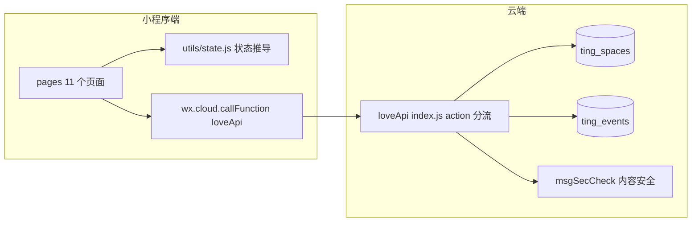

# 《听你的呀》软件设计架构说明（以代码为准）

> 版本：对应代码库 v3.0.0（`miniprogram/config/app-meta.js`）
> 编写日期：2026-08-17
> 依据：`C:\Users\LZM\WeChatProjects\miniprogram-1` 当前全部源码（云函数 + 11 个页面 + 状态推导 + 测试）
>
> **本文档描述的是"现在的软件"，不是《架构蓝图.md》。** 项目后期边开发边优化，代码已经与蓝图多处不同。凡与蓝图冲突处，以代码实际行为为准；差异清单见文末「八、与蓝图的主要差异」。

---

## 一、系统总览

《听你的呀》是一个记录爱情轨迹的微信小程序：外形式是「引导方 / 回应方」双角色互动，内核是爱。微信是唯一载体——身份用微信 openid，数据全部走微信云开发（云函数 + 云数据库），无独立服务器、无外部 API。

### 1.1 技术栈

| 项 | 值 |
|---|---|
| 平台 | 微信小程序（基础库 3.6.6，AppID 在本地私有配置中填写） |
| 后端 | 微信云开发，单一云函数 `loveApi`（action 分流） |
| 数据库 | `ting_spaces` / `ting_events` 两个集合，事务 `db.runTransaction` |
| 云环境 | 本地私有配置（`app.js` 的 `globalData.env`） |
| 依赖 | `wx-server-sdk ~2.4.0`、`lunar-javascript ^1.7.7`（七夕农历换算） |
| 测试 | `tests/state.test.js`（node assert，约定状态推导自检） |

### 1.2 顶层架构



### 1.3 目录结构

```
miniprogram-1/
├── cloudfunctions/loveApi/       # 唯一云函数
│   ├── index.js                  # 全部后端逻辑（action 分流）
│   ├── config.json               # 声明 openapi: security.msgSecCheck
│   └── package.json              # wx-server-sdk + lunar-javascript
├── miniprogram/
│   ├── app.js                    # 云初始化、globalData、restore()
│   ├── app.json                  # 11 页注册、3 Tab（今日/印记/我们）
│   ├── app.wxss                  # 设计 token（暖粉变量体系）
│   ├── config/app-meta.js        # version: "0.1.0"
│   ├── utils/state.js            # deriveState / deriveCardState / deriveCapsuleBox / CARDS
│   └── pages/
│       ├── index/                # 首页（今日）
│       ├── traces/               # 印记（时间线）
│       ├── profile/              # 我们
│       ├── pair/                 # 配对（创建 / 加入，同一页两模式）
│       ├── promise/              # 新建约定
│       ├── detail/               # 事项详情（约定 / 心意卡 / 卡片约定 三合一）
│       ├── ledger/               # 心意分流水
│       ├── cards/                # 心意卡册（7 张）
│       ├── diary/                # 日记空间（仅今天）
│       ├── anniversary/          # 纪念日管理
│       └── memories/             # 拾光之旅（空壳占位）
└── tests/state.test.js           # 状态推导自检
```

### 1.4 身份与配对模型（与蓝图不同）

实际代码里**没有 `initSpace`**。配对采用"邀请码 + 第二人确认时建空间"两段式：

1. 引导方填写空间信息 → 前端调 `genInviteCode` 生成随机邀请码（`sp_` 前缀）→ 邀请码连同空间名、双方称呼、开始日期全部放在**分享链接参数**里，存进前端 `app.globalData.invite`。
2. 回应方点开分享链接 → 进入配对页 join 模式 → 点「点确认，就正式在一起了」→ 调 `joinSpace`，**此时才在事务里创建 `ting_spaces` 文档（_id 就是邀请码）并落一条 `begin` 事件**。
3. 双方此后打开 App 都通过 `restore`（按 openid 查 `members` 含自己的空间）恢复身份，换手机也能找回。

空间 `_id` = 邀请码。配对完成前数据库里没有任何空间文档；`unread` / `score` 等字段都在 `joinSpace` 时初始化。

---

## 二、数据模型

### 2.1 ting_spaces（一对情侣一条，_id = 邀请码）

| 字段 | 类型 | 说明 |
|---|---|---|
| `_id` | string | 邀请码（`sp_` + 时间戳36进制 + 随机串） |
| `members` | string[] | `[引导方openid, 回应方openid]`，顺序固定 |
| `roles` | object | `{ openid: "guide" \| "respond" }` |
| `nicknames` | object | `{ openid: 称呼 }`，**锁定不可改**（仅 joinSpace 写入） |
| `spaceName` | string | 空间名 |
| `startDate` | string | 配对时选择的开始日期（也复制进 begin 事件 text） |
| `anniversaries` | array | `[{ name, date: "YYYY-MM-DD", remindCycle: "month"\|"year" }]`，整体替换 |
| `score` | number | 心意分余额（单数字 = 回应方余额） |
| `unread` | object | `{ openid: { threadId: true } }`，未读标记 |
| `pairingStatus` | string | 云端始终 `"paired"`；`"solo"` 只是首页本地展示态 |

### 2.2 ting_events（一切痕迹，只增不改）

| 字段 | 类型 | 说明 |
|---|---|---|
| `spaceId` | string | 空间 _id |
| `threadId` | string\|null | 线程标识（见下）；独立事件为 null |
| `kind` | string | `promise` / `card_activate` / `card_execute` / `none` |
| `type` | string | 事件类型（见 2.3 全表） |
| `actor` | string | `guide` / `respond` / `system`（festivalGrant、begin 为 system） |
| `text` | string | 原话/文案（≤50，initiate 可能是 JSON） |
| `score` | number\|null | 涉及分值（报价、发放等） |
| `cardType` | string\|null | 卡名（仅卡相关事件） |
| `moodTags` | string[]\|null | 心情标签（仅 mood 事件） |
| `createdAt` | number | 时间戳 |

**threadId 三种形态（状态推导与页面分流全靠它）**

| 形态 | 例子 | 用途 |
|---|---|---|
| 普通约定 | `sp_xxx_1680000000000` | `appendEvent` 中 `initiate` 且无 threadId 时生成 |
| 心意卡 | `card_写给你的信` | `card_activate` 事件，每张卡一个固定线程 |
| 卡片约定（兑换） | `sp_xxx_execute_1680000000000` | `redeemCard` 生成，`card_execute` |

### 2.3 事件类型全表（当前实现）

**约定域（kind=promise）**

| type | 谁发 | 含义 |
|---|---|---|
| `initiate` | 引导方 | 发起约定；text 为 `JSON{title, desc, way}`；也可作为「修改约定」再次发出（同 threadId） |
| `counter` | 回应方 | 讨价/再商量（须带理由文字） |
| `accept` | 回应方 | 接受（"嗯，就这样"） |
| `submit` | 回应方 | 提交完成（"做好啦，提交"） |
| `confirm` | 引导方 | 确认发放（"就这样，很好"） |
| `revise` | 引导方 | 驳回重做（"再试一次"，须带理由） |
| `cancel` | 引导方 | 取消（"取消这条约定"） |
| `begin` | system | 配对落日期（text = startDate），不计入任何状态 |

**心意卡域（kind=card_activate，threadId=card_卡名）**

| type | 谁发 | 含义 |
|---|---|---|
| `initiate` | 回应方 | 出价；text 为 `JSON{reason}` 或纯文本，score=出价 |
| `counter` | 引导方 | 还价；text=理由，score=新价 |
| `accept` | 双方 | 接受；**text 由云函数自动生成**「xx 和 xx 以 X 分生效了一张「卡名」」，score=锁定价 |
| `pause` | 引导方 | 暂不启用（软拒） |
| `cancel` | 回应方 | 撤回出价（前端按钮"这张卡先不发了"映射为 cancel） |
| `giveup` | 回应方 | 放弃（"这张卡先放着吧"） |

**卡片执行域（kind=card_execute，兑换后角色互换的约定）**

| type | 谁发 | 含义 |
|---|---|---|
| `initiate` | 回应方 | 兑换（`redeemCard` 生成，text=卡名，score=扣掉的分） |
| `submit` | 引导方 | 执行（"正在为你做这件事"，文字选填） |
| `pause` | 引导方 | 暂不执行（**退回兑换分**） |
| `confirm` | 回应方（或温柔终止后的引导方） | 确认完成（**不再加分**） |
| `revise` | 回应方 | 驳回（必填理由） |
| `cancel` | 双方 | 取消（**退回兑换分**） |

**独立域（kind=none，threadId=null）**

| type | 谁发 | 含义 |
|---|---|---|
| `journal` | 双方 | 随手记（text≤50，云函数强校验） |
| `mood` | 回应方 | 心情（moodTags 数组，≤3 个） |
| `anniversaryGrant` | 引导方 | 纪念日心意 +52（text=纪念日名） |
| `remember` | 引导方 | 先记着（静痕，无分值，text=纪念日名） |
| `festivalGrant` | system | 节日心意 +52（text=七夕/情人节，前端自动触发） |

### 2.4 预置常量

- **心意卡册 7 张**（`utils/state.js` `CARDS`，带说明文案）：写给你的信 / 你的时间归我 / 只这样叫你 / 我记得那一天 / 我们的小仪式 / 我眼里的你 / 我们拉勾勾。
- **心情标签 5 个**（`pages/index/index.js` `MOOD_TAGS`）：想躲进你怀里 / 想听你说爱我 / 想做你的挂件 / 今天很乖，随时待命 / 只想被你养着。**另有自定义心情输入（≤10 字）**。
- **节日**：七夕（`lunar-javascript` 农历换算）+ 情人节（2/14），固定 +52。
- **静默接受窗口**：`SILENT_ACCEPT_MS = 5 * 60 * 1000`。

---

## 三、云函数层（loveApi）

`cloudfunctions/loveApi/index.js` 是唯一后端入口，`exports.main` 按 `event.action` 分流，共 9 个 action。所有 action 都在 `try/catch` 内，异常统一返回 `{ success: false, msg: e.message || "error" }`。

通用约定：每次调用先取 `cloud.getWXContext().OPENID` 作为身份；凡涉及空间的 action 都校验「openid ∈ space.members」，越权一律返回「无权操作」；写操作全部用 `db.runTransaction`。

### 3.1 genInviteCode —— 生成邀请码

- 入参：无。
- 逻辑：循环最多 3 次，生成 `sp_ + Date.now().toString(36) + Math.random().toString(36).slice(2,10)`，查 `ting_spaces` 该 id 是否已存在；找到未占用的就返回。
- 出参：`{ success, code }`；3 次全撞返回失败，前端提示「没成功，别急，再试一次」。
- 说明：只生成码，不写任何数据；空间文档要等第二人确认时才创建。

### 3.2 joinSpace —— 第二人确认加入（唯一建空间入口）

- 入参：`code`（邀请码）、`guideOpenid`、`spaceName`、`guideName`、`respondName`、`startDate`。
- 校验链：
  1. 参数完整性 + `guideOpenid` 必须是 string 且 ≤64 字符；
  2. `guideOpenid === respondOpenid`（自己的 openid）→「不能接受自己的邀请」；
  3. spaceName / guideName / respondName 逐项过 `msgSecCheck`，违规 →「内容包含敏感词，请修改」。
- 事务内：
  1. 查 `code` 是否已被占用（已存在 →「邀请已经用过了」）；
  2. 创建空间文档：`members=[guide, respond]`、`roles`、`nicknames`（称呼就此锁定）、`spaceName`、`startDate`、`anniversaries=[]`、`score=0`、`unread={}`、`pairingStatus="paired"`；
  3. 落一条 `begin` 事件（kind=none，actor=system，text=startDate，threadId=null）。
- 事务失败时，若错误信息含 duplicate/id 判定为邀请码已用，否则「成交失败，请重试」。
- 出参：`{ success, spaceId, role: "respond", guideOpenid }`。

### 3.3 restore —— 身份恢复

- 入参：无。
- 逻辑：`where({ members: openid }).limit(1).get()` 查空间。
- 出参：`{ success, hasSpace, space?, role?, openid }`。无空间时 `hasSpace=false`。
- 说明：这是 App 每次启动、每个页面 onShow 的第一道闸；也承担换手机恢复身份。

### 3.4 appendEvent —— 核心落事件（落痕 + 改分 + 红点，一个事务）

入参：`spaceId, threadId?, type, text?, score?, kind?, cardType?, moodTags?`。

**处理顺序（严格按代码）：**

1. **判定事件域与权限**：按 `kind` 选择权限表——
   - `card_activate` → `CARD_PERMISSION`（initiate/cancel/giveup=respond，counter/pause=guide，accept=null 双方）；
   - `card_execute` → `EXECUTE_PERMISSION`（initiate=respond，submit/pause=guide，revise=respond，confirm/cancel=null 双方）；
   - 其余 → `PERMISSION`（initiate/confirm/revise/cancel=guide，counter/accept/submit/mood=respond，anniversaryGrant/remember=guide，journal/festivalGrant=null）。
   - 类型不在权限表 →「不支持的事件类型」。
2. **敏感词**：text 非空则 `msgSecCheck`（重试 1 次，仍失败放行，避免误伤）。
3. **事务内**：
   - 取空间，校验成员、校验角色（`requiredActor && role !== requiredActor` → 无权操作）；
   - 字数校验：**非 initiate 类型** text > 50 →「字数超限」（initiate 存 JSON，含 title15+desc30，不受此限；mood/journal/纪念日名都走此校验）；
   - **幂等**：`anniversaryGrant`/`remember` 查今年（`createdAt >= 今年1月1日`）是否已存在同名事件 →「今年已处理过」；`festivalGrant` 同类 →「今年已发过」；
   - **threadId 生成**：card_activate 无 tid → `card_卡名`；initiate 无 tid → `spaceId_时间戳`；其余无 tid 且非独立事件 →「参数不完整」；
   - **自动文案**：card_activate 的 accept 事件 text 自动生成「`称呼1` 和 `称呼2` 以 `X` 分生效了一张「`卡名`」」；
   - 写事件（actor 默认是操作方角色，festivalGrant 强制 system）；
   - **红点**：先清操作方自己在该线程的未读；`journal`/`mood` 不亮红点，其余类型给另一方该 threadId 标未读；
   - **改分（与写事件同事务）**：
     - 普通约定 `confirm`：查该线程最近一条带分事件（`accept`/`initiate`/`counter`，按 createdAt 倒序取 1）→ `score += 谈定分`；无带分事件 →「这次约定还没扰定分，先商量好再确认吧」；
     - `anniversaryGrant`/`festivalGrant`：`score += 52`；
     - card_execute 的 `pause`/`cancel`：查该线程 card_execute 的 initiate（兑换价）→ `score += price` 退回分；
     - `unread`/改分有变化才写 updateData，避免空对象更新报错。
4. 出参：`{ success, threadId, eventId }`。

### 3.5 queryEvents —— 查痕迹

- 入参：`spaceId, threadId?, limit?`（默认 50；页面实际传 100 或 1000）。
- 逻辑：成员校验后，`where({spaceId[, threadId]})` 按 `createdAt desc` 取 `limit` 条。
- 出参：`{ success, events }`。

### 3.6 markRead —— 灭红点

- 入参：`spaceId, threadId`。
- 逻辑：事务内把自己 `unread[openid][threadId]` 删掉（不存在则不动，不报错）。
- 说明：首页点击通知、详情页进入都会调它（详情页进入即已读）。

### 3.7 updateSpace —— 纪念日整体替换

- 入参：`spaceId, anniversaries`（数组）。
- 校验：必须是数组；每个元素须有 `name/date/remindCycle∈{month,year}`；name ≤20；name 过敏感词。
- 逻辑：成员校验后整组覆盖 `anniversaries`（增/删都是前端改好数组后整体提交）。

### 3.8 checkAnniversaries —— 今天有什么日子

- 入参：`spaceId`。
- 逻辑：成员校验后——
  - 遍历 `space.anniversaries`，日期是今天的（月/日匹配），且今年（幂等查询）还没有 anniversaryGrant/remember 记录 → 加入返回列表（附 `days`=已走天数）；
  - 七夕（`qixiSolar(year)` 农历 7/7 换算）+ 情人节（2/14）若今天且今年未发 festivalGrant → 加入 festival 列表。
- 出参：`{ success, anniversaries: [{name,date,remindCycle,days}], festivals: [{name}] }`。
- 说明：只"查"不"发"；发放由前端首页 checkReminders 对 festival 自动调 appendEvent。

### 3.9 redeemCard —— 兑换已生效卡（v2 心意卡兑换已实现）

- 入参：`spaceId, cardType`。
- 事务内：
  1. 成员校验 + **仅回应方**可兑换（`role !== "respond"` → 拒绝）；
  2. 查该卡 card_activate 的 accept 事件拿锁定价（无 →「这张卡未生效」）；
  3. 余额校验：`score < price` →「还差 X 分。先去完成几个约定，攒够了再兑换。」；
  4. 生成 threadId `spaceId_execute_时间戳`；
  5. `score -= price`（**立即扣分**）；
  6. 落 card_execute 的 initiate 事件（text=卡名，score=price）。
- 出参：`{ success, threadId }`。前端成功后 redirectTo 详情页。

### 3.10 安全与工程边界（代码实况）

- 身份 = openid，权限 = 云函数内 role 校验 + members 校验；无 token/session/JWT。
- 敏感词：joinSpace（3 个字段）、appendEvent（text）、updateSpace（纪念日名）；策略是"明确违规才拦，接口故障重试 1 次后放行"。
- 事务保护点：joinSpace（建空间+begin）、appendEvent（事件+分+红点）、markRead、updateSpace、redeemCard（扣分+事件）。
- 幂等：纪念日/节日每空间×每年一次（以 createdAt 在自然年内判断）。

---

## 四、状态机与核心逻辑（utils/state.js）

前端唯一状态推导源，页面不写第二份。三个函数 + 一个常量表。

### 4.1 deriveState(events) —— 约定状态推导

输入某 threadId 的全部事件（乱序也行，内部先按 createdAt 排序），输出：

`{ state, terminal, softEnd, silentAccept, counterCount, reviseCount, guideActions, respondActions }`

**状态判定顺序（自上而下取第一个命中）：**

| 条件 | state | terminal |
|---|---|---|
| 有 confirm | 已完成 | ✅ |
| 有 cancel | 已取消 | ✅ |
| revise 次数 ≥ 3 | 已取消 + softEnd（温柔终止） | ✅ |
| 有 submit | 待确认 | |
| 有 accept | 进行中 | |
| counter 次数 > 0 | 协商中 | |
| 只有 initiate 且距最后事件 ≥ 5 分钟 | 进行中（silentAccept） | |
| 其他 | 待回应 | |

**各状态可用动作（代码精确行为）：**

| 状态 | 引导方 guideActions | 回应方 respondActions |
|---|---|---|
| 待回应 | [cancel] | [counter, submit] |
| 协商中（counter<3，最后事件=counter） | [initiate, cancel] | [] |
| 协商中（counter<3，最后事件=initiate） | [] | [counter, accept] |
| 协商中（counter<3，其他） | [initiate, cancel] | [counter, accept] |
| 协商中（counter ≥ 3，第 3 次讨价后） | [cancel] | [] |
| 进行中 | [cancel] | [submit] |
| 待确认 | [confirm, revise, cancel] | []（若最后事件=revise 则 [submit]） |
| 温柔终止（revise≥3） | [confirm, cancel]（引导方最终决定权） | [] |
| 已完成 / 已取消（非温柔） | [] | [] |

要点：
- **讨价只数回应方**（`countByType(events, "counter")`），第 3 次讨价后引导方只剩取消；
- **驳回 ≤3 事不过三**：第 3 次 revise 触发温柔终止，引导方保留 confirm/cancel 收尾，且前端隐藏输入框、展示软文案；
- **静默接受不落痕**：只有「唯一 initiate 且超 5 分钟」才推成进行中，读取时判断；
- 「修改约定」= 同 threadId 再发一条 initiate，前端进入编辑区改标题/分值/理由。

### 4.2 deriveCardState(events) —— 心意卡状态推导

输入某卡（card_卡名 线程）的全部事件，输出：

`{ state, terminal, price, guideActions, respondActions }`

**状态：** `未激活`（无事件）→ `待回应`（initiate 后）→ `协商中`（counter 后）→ `已生效`（accept 后，terminal，price=accept.score）→ `暂不启用`（pause 后）→ `已放弃`（cancel/giveup 后）。

**动作（精确行为）：**

| 状态 | 引导方 | 回应方 |
|---|---|---|
| 待回应（第 1 次发起） | [accept, counter, pause] | [withdraw] |
| 待回应（第 2 次发起之后） | [accept, pause]（不再能还价） | []（不再显示"这张卡先不发了"） |
| 协商中 | [] | [offer, accept, giveup] |
| 暂不启用 / 已放弃 | [] | [offer]（重新发起） |
| 已生效 | [] | []（详情页单独给 redeem） |

要点：
- **每张卡一个固定线程**，谈判轮次 = 终止事件（pause/cancel/giveup）之后重新计数的 initiate 数；
- 出价/还价 2 次后（initiateCount≥2）引导方失去还价权，只剩 accept/pause；
- 卡协商次数没有硬性 3 轮限制，靠"发起 2 次封顶"收敛。

### 4.3 deriveCapsuleBox(events, role) —— 通知分类

把某线程最近事件归到「待回应 / 新动态」：

| 最近事件 | role | 分类 |
|---|---|---|
| counter | guide | 待回应 |
| submit | guide | 待回应 |
| revise | respond | 待回应 |
| initiate | respond | 待回应 |
| 其他 / 已终态 | — | 新动态 |

### 4.4 心意分总账（所有变动点）

| 来源 | 方向 | 金额 | 触发 |
|---|---|---|---|
| 约定 confirm | + | 该线程**最后谈定分**（最新 accept/initiate/counter 的 score） | 引导方确认 |
| 纪念日 anniversaryGrant | + | 52 | 引导方点「送 TA 52 分心意」 |
| 节日 festivalGrant | + | 52 | 七夕/情人节当天自动（system） |
| 卡片兑换 redeemCard | − | 锁定卡价 | 回应方兑换（立即扣） |
| 卡片执行 pause/cancel | + | 兑换价（退回） | 引导方暂不执行 / 回应方取消 |
| 卡片执行 confirm | 0 | — | 兑换已扣，完成不再加 |

余额存 `ting_spaces.score`，与事件**同事务**写入。流水页只展示正向（发放/纪念日心意/节日心意），兑换扣分与退回在流水页不出现。

### 4.5 红点与通知（实际实现）

- 存储：`ting_spaces.unread = { openid: { threadId: true } }`。
- 点亮：appendEvent 给**非操作方**标未读；journal / mood 不亮。
- 清除：markRead 逐条清；进入详情页自动清；操作方自己发事件也会顺带清掉自己那条。
- 展示：首页只显示一张「TA 在等你回话」卡（最多一个线程），优先展示"待回应"类（判断逻辑见 5.2）；印记页全程无红点。

### 4.6 敏感词与限制

- 云函数层对 text 统一过 msgSecCheck（明确违规才拦；接口故障重试 1 次后放行）。
- 字数：非 initiate 事件 text ≤50（云函数强校验）；前端输入框：约定标题 15 / 补充 30 / 理由 50 / 日记 100 / 自定义心情 10 / 纪念日名 20。

### 4.7 状态自检（tests/state.test.js）

覆盖：待回应、进行中、协商中（第 3 次讨价后引导方只剩 cancel）、已完成、revise 后再 submit 完成、温柔终止（softEnd）、静默接受（5 分钟）。运行：`node tests/state.test.js`。

---

## 五、页面模块（11 页，逐个交互）

### 5.1 配对页 pages/pair/pair

同一页面两种模式：正常进入=创建/等待；带分享参数=加入确认。

**onLoad 分流：**
- 带 `code` 参数（分享进入）：
  1. 若 `options.g === 我的openid` → toast「不能接受自己的邀请」并停在原页；
  2. `app.restore()` 若已结对 → switchTab 直接进首页；
  3. 否则进入 join 模式，用链接参数预填 spaceId / guideOpenid / guideName / respondName / spaceName / startDateText。
- 无参数：进入创建/等待模式；默认角色=引导方，开始日期默认今天（todayDate 上限）。

**创建模式（引导方 tab，默认）：**
- 表单：空间名（≤20）、引导方称呼（≤20）、回应方称呼（≤20，占位"想好了再填"）、开始时间（radio：就从今天重新出发 / 我们早就在一起了→日期 picker，范围 2000-01-01~今天）。
- 点「开启属于我们的空间」→ 确认 modal（展示空间名/双方称呼/开始时间 + 警告"分享给对方确认后才生效，确认前随时可以放弃"）。
- 确认后：无 openid 先 restore → `genInviteCode` 拿码 → 存 `app.globalData.invite = { code, spaceName, guideName, respondName, startDate, guideOpenid }` → switchTab 回首页。
- **此时数据库仍无空间**，首页显示"喊 TA 进来"邀请卡。

**等待模式（回应方 tab）：**
- 只有一张等待卡：「空间正在布置中」「等 TA 把邀请发来，点开就正式在一起了」。回应方在此页无任何输入。

**加入模式（join）：**
- 信息卡：空间名 / 引导方称呼 / 你的称呼 / 我们开始的时间；提示「称呼由 {guideName} 为你设定，一旦确认不再修改」。
- 点「点确认，就正式在一起了」→ `joinSpace`（前端 `_joining` 锁防连点）→ 成功则写 globalData（spaceId/role=respond）并 switchTab 首页；失败 toast 后端 msg。

### 5.2 首页 pages/index/index（Tab「今日」）

**启动逻辑：** onLoad 先 `app.restore()`；失败且存在 invite → 显示邀请卡，否则 reLaunch 配对页。onShow 有 spaceId 就 loadAll。

**页面结构自上而下：**

1. **邀请卡**（`pairingStatus === "solo"`，即创建空间后未配对时置顶显示）：
   - 「喊 TA 进来」按钮（open-type=share，走 onShareAppMessage 带全部邀请参数）；
   - 「放弃邀请，重新开始」→ confirm modal → 清 invite → reLaunch 配对页。
2. **Hero 卡**（暖粉渐变）：
   - 空间名标签；
   - 「❀ 我们在一起的第 N 天」：N = 从 `begin` 事件 text（startDate）到今天的自然日 +1；无 begin 则不显示；
   - 日记引子：对方今天最后一条 journal（「{称呼}今天写了 · {内容}」最多 3 行），点整卡 → diary；没有则显示「今天还没有日记」，同样可点；
   - **引导方视角**：显示对方今日心情标签（hasMood=有对方 mood 事件且 moodTags 非空）或空文案「{称呼}还没有留下今天的状态」；
   - **回应方视角**：心情选择器（5 预置标签 + 「输入你的心情」自定义，自定义 ≤10 字 + 确认/取消）：点选 ≤3 个（超过 toast「最多选 3 个心情」），再点取消选中；每次改动重置 3 秒定时器，到点自动 `appendEvent(mood, moodTags)` 发布（`moodPublishing` 锁防重）；
   - **CTA**：引导方=「新建约定」→ promise；回应方=「我的心意卡」→ cards。
3. **纪念日提醒卡**（仅引导方且今天有未处理纪念日）：标题「今天，值得好好记住」+ 文案（含名称、已走 X 天）+ 两个按钮：
   - 「送 TA 52 分心意」→ `appendEvent(anniversaryGrant)` 成功跳流水页，失败也收起提醒（幂等防重复弹）；
   - 「今天先记着」→ `appendEvent(remember)` 静痕，收起提醒。
4. **节日提醒卡**：七夕/情人节当天显示文案卡（texts），并由页面**自动**调 `appendEvent(festivalGrant)` 发放 +52（云函数幂等，重复打开不重复加）。
5. **摘要行**（4 格数字，为 0 弱化）：小事=未终态约定线程数；心意=待回应/协商中的卡数；随记=今天 journal 条数；日子=纪念日总数。
6. **「最近的小事」**：所有未终态线程列表（约定文本 + 状态标签），点击 → detail。空状态文案「最近还没有在继续的小事。想一起做点什么吗？可以从一个小约定开始。」
7. **通知卡「TA 在等你回话」**：从我的未读线程中选一个（优先"待回应"类；卡类按当前角色动作数判断），显示线程文本，点击 → markRead + 进 detail。

**分享：** onShareAppMessage 在 invite 存在时带 `code/g/n/gn/rn/sd` 参数和标题「我把我们的空间建好了，就差你了。进来，把我们的故事记下来。」；否则回默认标题。

### 5.3 新建约定 pages/promise/promise

仅引导方入口（首页 CTA）。表单：

- 约定标题（≤15）；
- 补充一句（≤30）；
- 希望怎样完成：radio「文字约定 / 拍照约定」；**选拍照约定时提示**「完成时请用微信把照片发给 TA。拍照功能预计后续版本开放」（半成品，无真实拍照）；
- 心意分：数字输入 0-50；**清空不当作 0**（提交时 `!score` 拦截提示「想好了再填」）；越界 toast「心意分在 0-50 之间，重新填一下」。
- 「发出这个小约定」→ `appendEvent(initiate, text=JSON{title,desc,way}, score)`（`submitting` 锁防连点）→ 成功 redirectTo 详情页。

### 5.4 事项详情 pages/detail/detail（三合一）

**路由识别**（onLoad 按 threadId）：以 `card_` 开头 → 心意卡；含 `_execute_` → 卡片约定；否则 → 普通约定。

**公共部分：**
- 加载：`queryEvents(threadId)` → 事件倒序 → 按类型推导状态；
- Hero：标题（约定=标题；卡=卡名）、状态标签、最新消息/说明、分值；
- 动作按钮区：按状态给出可点按钮（文本见 ACTION_LABEL / CARD_ACTION_LABEL）；「submit」排序到最前；
- 输入区：textarea ≤50「想对 TA 说一句什么？（选填）」；
- 软文案区（softCopy）：讨价第 3 次给回应方、温柔终止双方、卡出价 2 次截止给回应方、暂不启用给回应方；
- 事件流折叠卡「这个约定的经过」：每条 = 内容 + 「{动作} · {称呼/系统} · {M-D HH:mm}」；
- **进入即已读**：load 完成后台调 markRead。

**普通约定：**
- info：标题/说明取自第一条 initiate 的 JSON；分数 = 最新一条带分 initiate/counter 的 score（与 confirm 入账口径一致）；「对方最新消息」取对方最近 counter 或修改 initiate 的 text/reason；
- 输入区显示条件：回应方在 待回应/协商中/进行中 可见（协商中最后事件是 counter 时隐藏）；引导方在待确认点「再试一次」后显示理由输入；
- 动作细节：
  - 回应方「再商量一下」→ 必须填理由（toast「先写一下理由」）→ counter；
  - 回应方「嗯，就这样」→ accept（不带文字）；
  - 回应方「做好啦，提交」→ submit（文字选填）；
  - 引导方「修改约定」（协商中）→ 编辑区（标题/分值/修改理由选填）→ 提交新 initiate（JSON 完整覆盖 title/desc，way 固定"文字约定"）；
  - 引导方「就这样，很好」→ confirm（**不带 text**，分数由云函数取最后谈定分入账）；
  - 引导方「再试一次」→ 先展开理由输入 → revise；
  - 引导方「取消这条约定」→ cancel；
  - 温柔终止态：隐藏输入框，引导方只剩「就这样，很好/取消这条约定」；
- 编辑区（`editingInitiate && !isCard`）：约定标题/心意分/修改理由 + 确认修改/取消；标题与分值必填。

**心意卡（isCard）：**
- info：卡名 + CARDS 描述 + 状态 + 最新报价（initiate/counter 最近一条：分值 + 理由）；已生效显示「已锁定 {price} 分 · 以后可以随时唤起这个小心意」；
- 动作：
  - 回应方「再商量一下」→ 编辑区（新分值 + 理由选填）→ initiate（JSON{reason}）；
  - 回应方「按这个分来」→ accept；
  - 回应方「这张卡先不发了」→ cancel（withdraw 映射）；「这张卡先放着吧」→ giveup；
  - 回应方在协商中可 offer（再出价）/accept/giveup；
  - 已生效 → 回应方唯一按钮「使用心意卡」→ `redeemCard`（`redeeming` 锁防连点）→ 成功 toast「已经用上了」+ redirectTo 新线程详情；余额不足 toast 后端 msg；
  - 引导方在待回应 → 接受（按这个分来）/再商量（counter：分值+理由）/暂不启用（pause）；
  - 出价 2 次后引导方只剩 accept/pause；
- 事件流展示：报价事件显示「{X} 分 · {理由}」，accept 显示自动生成文案（避免重复分值）。

**卡片约定（isExecute，v2 兑换流程）：**
- 状态改写：deriveState 的「待回应」在此显示为「待执行」；
- 动作：
  - 引导方在待执行/被驳回后 →「做好啦，提交」（submit，文字选填）/「暂不执行」（pause，文字选填，**退回兑换分**）；
  - 回应方在待确认 →「就这样，很好」（confirm，文字选填）/「再试一次」（revise，**必填理由**）/「取消这条约定」（cancel，**退回分**）；
  - 温柔终止后引导方 → confirm/cancel 收尾；
- 输入区除温柔终止外始终显示；
- 事件文案专用翻译（submit="答应了，正在为你做这件事"、pause="今天先不做这张卡片的约定。不是不答应，是想等更好的时候。卡还在。"、revise="希望更好，再试一次也愿意等"、cancel="「{卡名}」的约定，先放下了"、confirm="收到了，很满足"）；
- info.title 始终取卡名（从第一个 initiate 的 cardType 或 threadId 解析）。

### 5.5 印记 pages/traces/traces（Tab「印记」）

- 筛选 tab：全部 / 约定（kind=promise）/ 心意卡（kind=card_activate）/ 随手记（journal）/ 心情（mood）；
- 数据：`queryEvents(limit 1000)` 全量时间线，按 createdAt 倒序；
- 每条：图标 + 动作名（TYPE_LABEL）+ 「类别 · 具体名」（约定取线程最新 initiate 的 title；卡取 cardType；随记/纪念日/节日取 text；心情取标签串）+ 内容 + 「时间 · 称呼/系统」；
- 内容特化：promise 的 cancel 显示固定软文案；remember 显示「这一天，被记着了」；begin 显示「你们的故事，从这一天开始」；卡报价取 JSON.reason；
- 零红点；空状态「这里还空着，去留下第一条印记吧」；
- **可见性规则（代码现状）**：后端 queryEvents 不做日记过滤，前端 traces 页也未过滤 journal——即**当前印记页实际上能看到双方的全部随手记/心情**（与蓝图"对方历史日记各自私藏"的差异见文末）。
### 5.6 心意卡册 pages/cards/cards

- 入口：回应方首页 CTA「我的心意卡」（引导方无常驻入口，只能经通知/详情进入）。
- 数据：`queryEvents(limit 100)` 里所有 card_activate 事件按 cardType 分组 → 对 CARDS 7 张逐一 deriveCardState。
- 每张卡：卡名 + 描述 + 状态标签（未激活/待回应/协商中/已生效/暂不启用/已放弃）；已生效高亮（「已锁定 {price} 分 · 以后可以随时唤起这个小心意」）、其余弱化；
- 回应方专属：
  - 未激活 / 暂不启用 → 卡片内按钮「出价 / 重新启用」→ 展开输入区（「这张卡，值多少心意分？」0-999 + 发送给对方/取消）→ `appendEvent(initiate, score)`；
  - 暂不启用时卡片内展示软文案（蓝图原文）；
- 点击整卡（除按钮外）→ detail（threadId=card_卡名），卡协商的后续动作（还价/接受/放弃等）都在详情页完成；
- 已生效的卡在卡册无「使用」按钮，须进详情。

### 5.7 日记空间 pages/diary/diary

- 入口：首页 Hero 日记引子点击。
- 结构：写作区置顶（textarea ≤100 占位「此刻，想对 TA 说一句什么？」+「记一笔此刻」按钮）→「我的」区块 →「对方」区块；
- 数据：`queryEvents(limit 100)` → 仅保留今天（createdAt ≥ 今日0点）的 journal → 按 actor 分两栏，各自时间倒序；
- 区块标题随角色变化：回应方看「我的今天 / {称呼} 的回应」；引导方看「我今天的回应 / {称呼} 今天写了什么」；
- 空态：「今天还没写下此刻」「{称呼} 今天还没留下只言片语」；
- 发布：`appendEvent(journal)`，成功清空输入并刷新；失败 toast「没成功，别急，再试一次」；
- **可见性**：只显示今天双方的全部日记；过往日记后端可查、前端不展示（仅今天），但痕迹页能回看（见 5.5 差异说明）。

### 5.8 纪念日管理 pages/anniversary/anniversary

- 入口：「我的」页菜单。
- 列表：每条 = 名称 + 周期标签（每年/每月）+ 「已经一起走了 X 天」（若开始日期 ≤ 今天）+ 「✦ {下次日期} · 还有 X 天」+ 删除按钮；
  - 下次日期计算：今年若未到则今年，已到则按 remindCycle 推到下月同日 / 明年同日；
- 添加表单（默认收起，点「添加纪念日」展开）：名称（≤20）/ 日期 picker / 周期 radio（每年/每月）+ 保存；
- 增删都是本地改数组 → `updateSpace` 整体替换；成功刷新，失败 toast；
- 空状态「还没记下特别的日子。你们第一次见面的那天，就很值得记住。」

### 5.9 心意分流水 pages/ledger/ledger

- 入口：首页纪念日送分后跳转；「我的」页回应方分数 hero 点击。
- 数据：`queryEvents(limit 100)` → 只筛带分值且类型为 confirm（发放）/ anniversaryGrant（纪念日心意）/ festivalGrant（节日心意）的事件，倒序；
- 每行：标签 + 「+{X} 分」+ 标题（约定取该线程最新 initiate 的 title；纪念日/节日取事件 text）+ 日期（YYYY-MM-DD）；
- 空态「还没有积攒下心意分哦。完成约定，就会慢慢攒起来」；
- 注意：兑换扣分、退回分**不在此页展示**（TYPE_LABEL 只含三种正项）。

### 5.10 我的 pages/profile/profile（Tab「我们」）

- Hero（点击触发 5 连点检测）：标题「我们」+ 文案；引导方显示 ❀ 图标，回应方显示「{score} 分 · 爱的积蓄」（点击 → ledger）；
- 版本区：底部「始于初见，止于终老」+ v3.0.0；**3 秒内连点版本号 5 次** → 拾光之旅（隐藏入口）；
- 菜单卡：「纪念日」（→ anniversary）、「拾光之旅」（→ memories）。

### 5.11 拾光之旅 pages/memories/memories（占位）

- `Page({})` 空实现 + 文案「这里还空着。等我们把故事收好，到重逢时，再一起打开。」。备份/恢复未实现。

---

## 六、端到端流程（完整用例）

### 6.1 配对（两台手机）

1. 手机A（引导方）：打开 → 配对页 → 填空间名/双方称呼/开始时间 → 「开启属于我们的空间」→ 确认 modal → 生成邀请码 → 回首页看到「喊 TA 进来」邀请卡；
2. A 点「喊 TA 进来」分享给 B；
3. 手机B（回应方）：点开 → 配对页 join 模式（信息卡预填）→「点确认，就正式在一起了」→ joinSpace 建空间 + begin 事件 → 进首页；
4. 双方杀进程重开 / B 删小程序重进 → restore 找回空间，不再回配对页。

### 6.2 约定全周期

**顺利路：** 引导方 promise 发起（initiate）→ 回应方首页通知卡出现 → 详情「嗯，就这样」（accept）→ 进行中 → 回应方「做好啦，提交」（submit）→ 引导方「就这样，很好」（confirm）→ 已完成；分数按最后谈定分入账，流水出现「发放」。

**协商路：** initiate → 回应方「再商量一下」+理由（counter）→ 引导方「修改约定」改分/标题（新 initiate）或「取消」（cancel）→ 回应方再 counter/accept → … 回应方 counter 达 3 次 → 引导方只剩「取消这条约定」，回应方看到软文案。

**驳回路：** …submit → 引导方「再试一次」+理由（revise）→ 回应方重新 submit → 确认；revise 达 3 次 → 温柔终止（已取消 + softEnd）→ 双方看到温柔文案，引导方保留 confirm/cancel 最终收尾。

**静默接受：** initiate 后回应方 5 分钟未动 → 打开时状态直接显示「进行中」（不落痕）。

### 6.3 心意卡激活

1. 回应方卡册选卡出价（initiate+score）→ 引导方详情「按这个分来」（accept，云函数自动文案+锁价）/「再商量一下」还价（counter）/「暂不启用」（pause）；
2. 还价后回应方「再商量一下」（新 initiate）/「按这个分来」（accept）/「这张卡先放着吧」（giveup）；
3. 第二次出价后引导方只剩 accept/pause；accept 后卡「已生效 · 锁定 price」，价格从此锁定。

### 6.4 心意卡兑换执行（v2 已实现）

1. 回应方在已生效卡详情点「使用心意卡」→ redeemCard：余额足则**立即扣分**并生成 card_execute 线程；
2. 引导方收到通知 → 详情「做好啦，提交」（submit，即执行）或「暂不执行」（pause，退回分）；
3. 回应方「就这样，很好」（confirm，不再加分）→ 完成；或「再试一次」（revise 必填理由，最多 3 次温柔终止）→ 引导方重新执行；或「取消这条约定」（cancel，退回分）；
4. 温柔终止后引导方 confirm/cancel 收尾。

### 6.5 纪念日 / 节日

- 纪念日：双方在「我的」管理 → 当天打开 App：**引导方**收到提醒卡 → 送 52 分（+52 且幂等）/ 先记着（静痕防重复弹）；
- 节日：七夕（农历）/ 情人节当天双方打开 App → 首页节日卡 + 自动 festivalGrant +52（幂等，重复打开不重复加）；
- 当天未打开：节日**不补发**（代码中无补发逻辑；checkAnniversaries 只查当天），纪念日提醒过期自然消失。

---

## 七、权限矩阵（谁在什么状态能做什么）

| 动作 | 引导方 | 回应方 | 触发状态（前端按钮） |
|---|:--:|:--:|---|
| 新建约定 | ● | | 首页 CTA |
| 修改约定 / 回应讨价 | ● | | 协商中（counter 后） |
| 讨价（counter） | | ● | 待回应 / 协商中（回应方，≤3 次） |
| 接受约定（accept） | | ● | 协商中（initiate 后） |
| 提交完成（submit） | | ● | 进行中 / 驳回后 |
| 确认发放（confirm） | ● | | 待确认；温柔终止后双方可 |
| 驳回（revise） | ● | | 待确认（≤3 次） |
| 取消约定（cancel） | ● | | 各非终态 |
| 卡片出价 / 再出价 / 放弃 | | ● | 卡未激活 / 暂不启用 / 协商中 |
| 卡片还价 / 暂不启用 | ● | | 卡待回应（≤2 次出价） |
| 卡片接受 | ●（accept 出价） | ●（accept 还价） | 待回应 / 协商中 |
| 兑换卡片 | | ● | 卡已生效（详情页） |
| 卡片执行 / 暂不执行 | ● | | 待执行（兑换后） |
| 卡片确认 / 驳回 / 取消 | | ● | 待确认；温柔终止后引导方可 confirm/cancel |
| 写随手记 | ● | ● | 日记空间 |
| 设心情 | | ● | 首页选择器 |
| 纪念日增删 | ● | ● | 我的 → 纪念日 |
| 送 52 / 先记着 | ● | | 首页提醒卡（仅引导方收到） |

后端权限是**最终防线**（角色校验 + members 校验），前端按钮只是交互呈现。

---

## 八、与《架构蓝图》的主要差异（代码现状为准）

| # | 蓝图设计 | 代码现状 |
|---|---|---|
| 1 | 配对：initSpace 先建空间再邀请 | 无 initSpace；genInviteCode 只发码，joinSpace 第二人确认时才建空间，空间 _id=邀请码 |
| 2 | 通知胶囊两格（待回应+新动态） | 单张「TA 在等你回话」卡（最多一个线程），deriveCapsuleBox 分类函数保留但 UI 合并 |
| 3 | 心情标签 6 条 | 5 条预置 + **自定义心情输入（≤10字）** |
| 4 | 约定协商：引导方回应讨价 | 当前统一用「修改约定」（同 threadId 新 initiate）完成回应，不再单独写入回应事件 |
| 5 | 卡片协商 ≤2 轮 | 出价 2 次封顶（第 2 次后引导方只剩 accept/pause） |
| 6 | 卡片有 withdraw（撤回）/giveup（放弃）按钮 | 已在代码实现（蓝图为「撤回出价/放弃」） |
| 7 | 心意卡兑换是二期 | **v2 兑换已实现**：redeemCard + card_execute 线程 + 详情页执行流 + 退回分 |
| 8 | 日记对方历史永不可见 | 痕迹页未过滤 journal/mood，**双方全量随手记/心情都能在印记回看**；日记空间仍只显示今天 |
| 9 | 首页底部「在一起 N 天 · X 小心意」 | 第 N 天放进 Hero；无 X 小心意行；摘要行改为 小事/心意/随记/日子 四格 |
| 10 | 节日心意补发（当天未打开也补） | **未实现**；只发当天 |
| 11 | 纪念日提醒过期作废 | 未显式实现（checkAnniversaries 只查当天，自然作废） |
| 12 | 拾光之旅（备份/恢复） | 空壳占位 |
| 13 | 拍照约定 | 仍是半成品：选「拍照约定」仅提示"后续版本开放" |
| 14 | 印记筛选 全部/约定/心意卡/随手记 | 多一个「心情」筛选 |
| 15 | 首页「正在做的事」区块 | 文案为「最近的小事」 |
| 16 | 流水含兑换/退回负项 | 流水只显示三种正向（发放/纪念日/节日） |
| 17 | 我的页无隐藏入口 | 版本号 3 秒内连点 5 次进拾光之旅 |
| 18 | begin 事件 | 新增（配对落日期，驱动"第 N 天"） |
| 19 | 旧版状态常量清理 | 无用事件常量已移除；SILENT_ACCEPT_MS 仅用于静默接受逻辑与测试 |

---

## 九、已知缺口与建议（诚实清单）

1. **拾光之旅**是空壳（profile 菜单 + 隐藏入口都指向它）。
2. **拍照约定**半成品（"预计后续版本开放"文案）。
3. **app.js 环境 ID 需由部署者配置**；公开仓库只保留占位值，不能直接用于生产环境。
4. **日记前端 maxlength=100 与云函数 50 字强校验不一致**——超 50 字提交会被后端拒（toast 未成功），前端应改为 50 或后端放宽。
5. **痕迹页可见性**与蓝图"私藏"意图相反（双方全量可见），需产品决策是否过滤。
6. **印记页 limit 1000** 无分页，事件超千会截断；(spaceId, createdAt) 复合索引未建（数据量小，暂可接受）。
7. **流水不展示兑换/退回**，用户对账可能困惑（走查已记入"分账可视化"低优先项）。
8. **节日当天未打开不补发**（蓝图要求补发，未实现）。
9. 云函数改动需在微信开发者工具手动重新部署后才生效。

---

## 2026-08-17 当前实现覆盖（以代码为准）

### 版本与原则

- 当前本地版本为 `3.0.0`。
- 仍只有 `ting_spaces`、`ting_events` 两个集合和一个 `loveApi` 云函数。
- 昨日之后没有为心情回应、首页缓存或语气导入新增云函数。

### 首页读取架构

首页采用本地优先、云端后台校准：本地 `ting_home_cache_active` 指向按 `spaceId` 隔离的首页快照，先渲染角色、昵称、Hero、心情、日记、统计和进行中事项，再调用现有 `restore` / `queryEvents` 更新并回写缓存。首次进入不再重复调用两次 `restore`。缓存只负责展示，操作权限和写入仍由云端确认；解除或切换空间时清理旧缓存。

### 事件与状态补充

- 心情回应复用现有事件字段：回应随手记使用 `threadId: mood_<moodEventId>` 和 `moodTags` 保存原心情快照，不新增 `replyTo*` 字段。
- 详情页顶部会读取对方的 `submit`，不再只在历史列表展示。
- `revise` 后动作归属修正为：驳回方无按钮，被驳回方可重新 `submit`。
- 首页“有新的回音”过滤 terminal 约定、已生效/已放弃卡片，避免历史未读残留继续显示。
- 心意卡顶部补齐 `pause / cancel / giveup` 最新动作；执行阶段覆盖 submit、pause、confirm、revise、cancel。

### 拾光、解除与本机语气

- 个人页版本行连续点击 5 次，展开页面内操作卡；不再使用原生 ActionSheet。
- 劝阻文案只在五次点击卡片出现；最终解除页只做空间名确认，不重复长文案，不显示备份解释卡。
- 恢复入口通过 `type: copy_pack` 识别本机语气 JSON；导入写入 `ting_copy_pack_imported` 和 `ting_copy_pack_id=imported_v1`，以温柔包递归覆盖，不改云端空间。
- TabBar 原生样式由 `app.applyThemeChrome` 随主题同步更新：未选中使用主题弱色，选中使用主题强调色。

